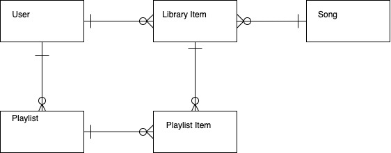
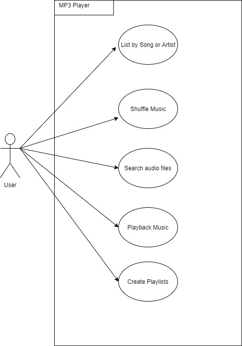
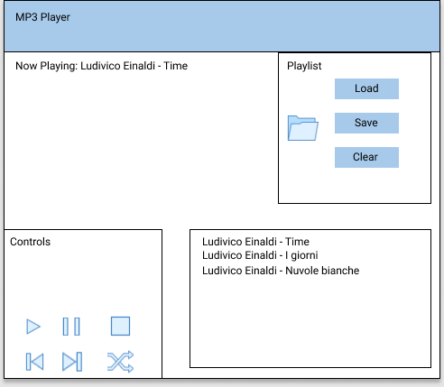

# MP3 Player
QA Synoptic Project

# Background Information
- Rebmem Engineering has provided electronic goods for several years to third parties and are now looking to expand their offering to supply interactive goods.  
- They produce portable storage devices and have worked on a new device that will allow the storage and playback of music.  
- They would like a simple interface built to interact with the device to allow the continuation of development. (Interaction with the firmware will be discussed and implemented at phase two.) 
- The client is a large organisation and if this goes well could mean a large contract. 
- Your role will be to take on the development of the interface ensuring that you meet the first phase requirements; any additional elements you can include will help but the deadline is close.  
- The hardware is still being tested so changes will be required as it is developed. Ensure that you fully document each step to allow us to carry out any changes later. 

# User Guide

- User opens .mp3 file/s stored within their local system
- User can play, pause, stop, skip and shuffle through the list of files added to the MP3 Player

# Models and Diagrams

- Conceptual model for the planned database.

- Model showing the way the user may interact with the MP3 Player

- Prototype Interface Design

# Development still required

- Saving of playlists
- Loading of playlists
- MP3 Player going idle after 30 seconds
- Connection to a database
- Search through the media files on database
